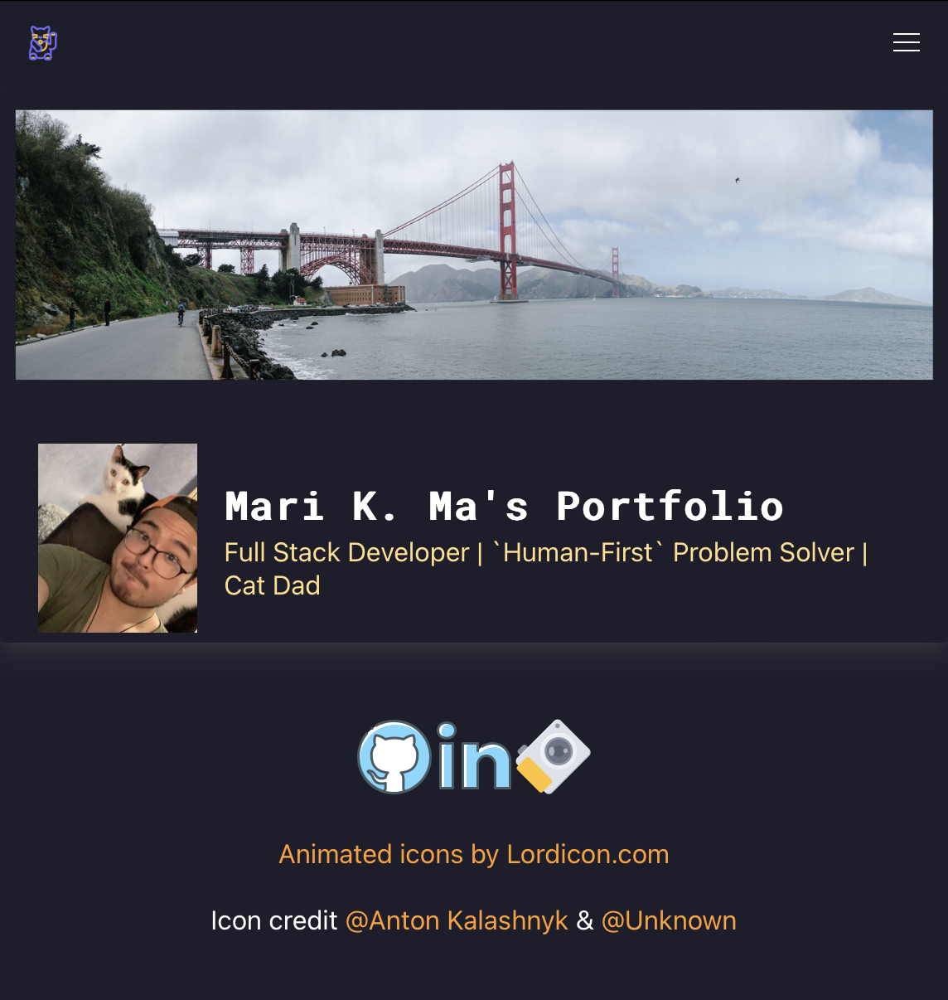

# react-cv


## Description

A front-end react app revamp of a previous portfolio. Build with react.js, custom bulma, deployed to gh-pages

[Click here for the deployed site!](https://draconmarius.github.io/react-cv/)

[](https://draconmarius.github.io/react-cv/)

## Usage

If you are interested in hosting a version on you local machine, feel free to clone this repository to your local machine, and you can run the following npm command to install all required packages:

``` bash
    npm install
```

then:

``` bash
    npm start
```
to initate the react app. Once everything has been compiled, you should be able to navigate to a localhost port to see the portfolio up and running!


## License

Licensed under the MIT license.
[License details here](https://opensource.org/licenses/MIT)

## Technologies Used
> JavaScript

> node.js

> express.js

> react.js

> bulma

> bulma-collapsible

> sass

## Authors

[](https://github.com/DraconMarius)
[](https://www.linkedin.com/in/mari-ma-70771585/)

[Icon credit @ Anton Kalashnyk](https://icon-icons.com/users/14quJ7FM9cYdQZHidnZoM/icon-sets/)

## Contributing Guidlines

If you would like to contribute to this app, please contact me on the above links and we can discuss further.

## Questions

For any questions, please reach out by creating an issue.
